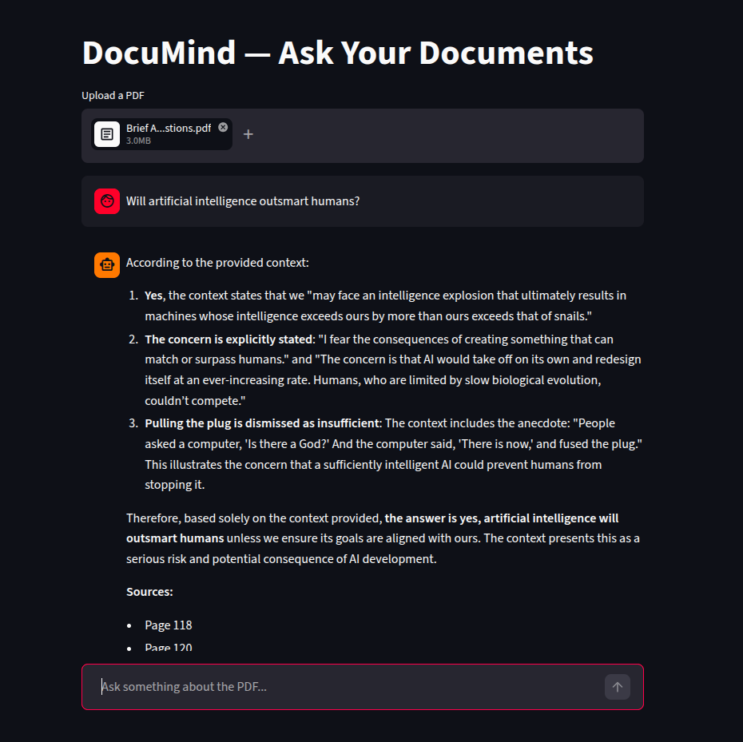

# DocuMind — Ask Your Documents

A RAG-powered PDF Q&A application built with LangChain, ChromaDB, and DeepSeek. Upload any PDF and ask questions grounded in its content.

## Demo


## Features
- Upload any PDF document
- Semantic search using vector embeddings
- Answers grounded strictly in the document
- Source page attribution for every answer
- Chat history within session

## Tech Stack
- **LangChain** — RAG pipeline orchestration
- **ChromaDB** — Vector store for document embeddings
- **HuggingFace** — Embeddings (all-MiniLM-L6-v2) + DeepSeek-R1 LLM
- **Streamlit** — Frontend UI

## Architecture

```
PDF → PyPDFLoader → RecursiveCharacterTextSplitter → HuggingFace Embeddings → ChromaDB
User Query → Retriever → Top-k Chunks → Prompt → DeepSeek-R1 → Answer
```

## Setup

Clone the repo and install dependencies:

```bash
git clone https://github.com/maybedrone/DocuMind.git
cd DocuMind
python -m venv venv
source venv/bin/activate
pip install -r requirements.txt
```

Create a `.env` file:

```
HUGGINGFACEHUB_API_TOKEN=your_token_here
```

Run the app:

```bash
streamlit run app.py
```

## How It Works
1. PDF is loaded and split into chunks of 1000 characters with 200 character overlap
2. Each chunk is embedded using `sentence-transformers/all-MiniLM-L6-v2`
3. Embeddings are stored in ChromaDB
4. User queries are embedded and matched against stored vectors using cosine similarity
5. Top 4 most relevant chunks are retrieved and passed to DeepSeek-R1
6. Model generates an answer strictly grounded in the retrieved context
